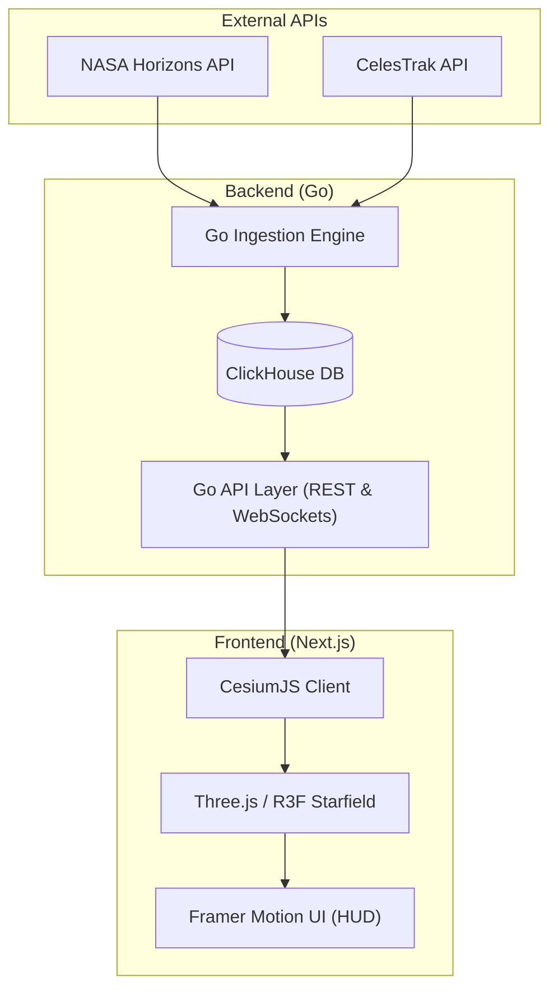

# 🌌 Project Zenith — The Celestial Eye


**Project Zenith** is an immersive astronomical exploration platform that reimagines how users interact with real-time space data. Instead of conventional dashboards or static maps, Zenith creates a **cinematic, telescope-driven experience** that lets any user discover exactly what is currently passing above their chosen location on Earth — satellites, the ISS, planets, deep-space objects, and constellations — all rendered in live 3-D.

The guiding question is simple: _“What is currently passing above me in space?”_ Answering it demands high-fidelity telemetry, robust data engineering, and a visually compelling interface that makes orbital mechanics accessible to everyone.

---

## ⚡ Key Features

- **🚀 Real-Time Telemetry Pipeline**: Fault-tolerant data ingestion merging NASA Horizons and CelesTrak.
- **🛰️ Cinematic 3-D Exploration**: Beautiful rendering powered by CesiumJS for the globe and Three.js for deep-space starfields.
- **📈 High-Performance Storage**: OLAP column-store persistence using ClickHouse for millisecond spatial and time-series queries.
- **🌐 Seamless Web UI**: Built with Next.js 16 (App Router), Tailwind CSS, and Framer Motion for buttery-smooth telescope zoom transitions.
- **📡 Live Data Streaming**: WebSocket integration for push-based real-time telemetry sync from the Go backend.

---

## 🏗️ Architecture

Zenith separates concerns clearly across data ingestion, storage, API delivery, and immersive rendering.



---

## 🧰 Technology Stack

| Layer | Technology | Purpose / Justification |
| :--- | :--- | :--- |
| **Frontend** | Next.js + React | SSR rendering, route management, component architecture |
| | CesiumJS | 3-D Earth globe, orbital path vis., satellite markers |
| | Three.js / R3F | Deep-space starfields, nebulae, cinematic 3-D scenes |
| | Framer Motion | Telescope zoom transitions, HUD animations, parallax effects |
| | Zustand | Lightweight, hook-based global state management |
| **Backend** | Golang | High-concurrency API polling, TLE parsing, stream broadcasting |
| | ClickHouse | OLAP column store — millisecond time-series & spatial queries |
| | WebSockets | Push-based real-time telemetry sync to frontend |
| | REST API (`chi`) | On-demand celestial object lookup, coordinate queries |
| **Infra** | Docker | Containerised deployment for the backend services |

---

## 🚀 Getting Started

### Prerequisites
- Node.js (v18+)
- Go (1.21+)
- A Cloud ClickHouse instance or Local Docker Setup
- API Tokens (Cesium Ion)

### Installation

1. **Clone the repository**
   ```bash
   git clone https://github.com/yourusername/zenith.git
   cd zenith
   ```

2. **Configure Environment Variables**
   Copy `.env.example` to `.env` and fill in your Cloud DB and Cesium tokens.
   ```bash
   cp .env.example .env
   ```

3. **Start the Go Backend**
   ```bash
   cd backend
   go run cmd/api/main.go
   ```

4. **Start the Next.js Frontend**
   ```bash
   cd frontend
   npm install
   npm run dev
   ```

5. **Explore**
   Open `http://localhost:3000` in your browser.
